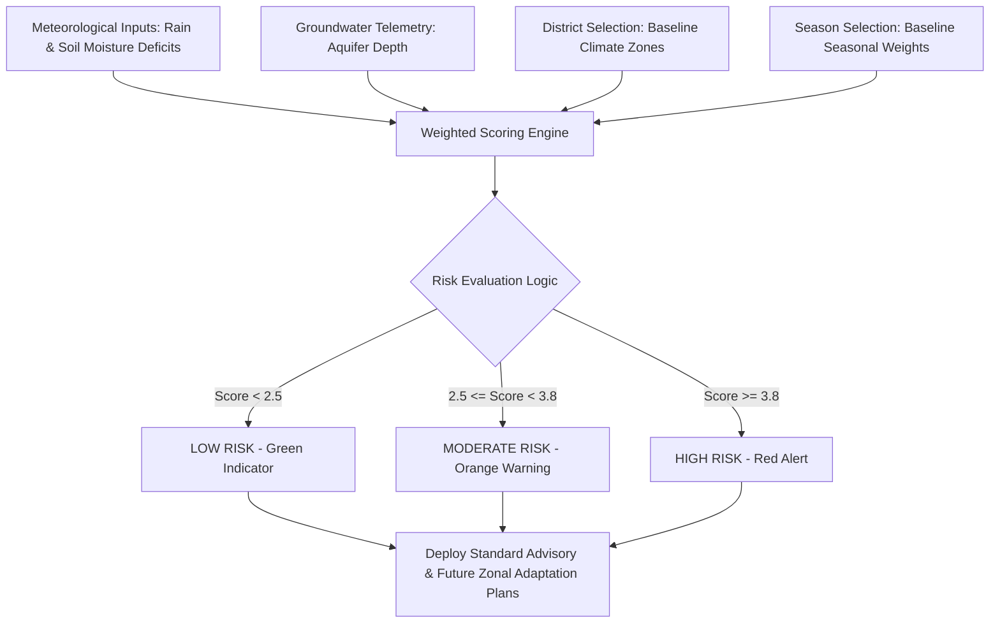

# 💧 AquaAlert AI: AI-Powered Water Scarcity Early Warning System

[](https://sdgs.un.org/goals/goal6)
[](https://sdgs.un.org/goals/goal13)
[](#)

AquaAlert AI is an interactive, intelligent hydro-geological simulation and early-warning prediction tool designed specifically for the state of **Rajasthan, India**. This system is built to help rural communities, farmers, agricultural boards, and administrative blocks transition from a **reactive** response to a **proactive** stance against aquifer depletion and drought cycles.

Developed as part of the **AICTE Internship**, **1M1B (1 Million 1 Billion) Youth for SDG**, and **IBM SkillsBuild** programs.

---

## 👥 Developers & Affiliation

* **Manish Kumar Prajapat**
* **Abhay Singh Sankhla**
* **Institution:** ICFAI University Jaipur
* **Mentorship Partners:** 1M1B Youth For SDG | IBM SkillsBuild | AICTE Internship

---

## 📖 The Problem

Rajasthan is India's largest state by land area, yet it is one of the most water-stressed regions in the country:
1. **Critical Geography:** Rajasthan holds **only 1.2% of India's surface water resources**. Over 60% of the state is enveloped by the Thar Desert.
2. **Declining Aquifers:** Groundwater extraction rates far exceed natural replenishment. 
3. **Climate Volatility:** Shorter monsoons, erratic rainfall patterns, and high summer evapotranspiration compress crop seasons and deplete local wells.
4. **Lack of Early Warnings:** Most rural agricultural blocks lack access to forecast data, leading to agricultural failure, livestock distress, and economic crises before corrective irrigation policies can be deployed.

---

## 💡 The Solution: AquaAlert AI

AquaAlert AI models localized water-security risk indices using multi-variable environmental diagnostics. It offers:
* **Interactive Hydro-Model Simulation:** Allows users to simulate drought factors (rainfall deficits, soil moisture levels, and aquifer depths) to observe immediate water-stress forecasts.
* **Geographic Analytics Map:** An interactive, vector-based SVG map representing all **33 districts of Rajasthan**, allowing localized assessment.
* **Future-Ready Zonal Plans:** Tailored adaptation actions (such as contour check-dams, halophyte agroforestry, active aquifer recharge, and subsurface drip irrigation) based on regional climate zones.

---

## 🌟 Key Features

### 1. Live Hydro-Analytics Operations Center
* Located on the main dashboard, this panel showcases simulated live telemetry updates (e.g., Average Soil Moisture, Monsoonal Rain Deficits) with rolling visual sparklines.
* Provides a simulated **AI Predictive Computation Log Console** illustrating how a real-time recurred neural model (LSTM) ingests satellite data (ISRO/IMD/NDVI indices) to output 30-day forecast warnings.

### 2. Interactive Geographic Vector Map
* A fully interactive SVG vector map of Rajasthan's 33 districts.
* Selecting a district dynamically populates its climate zone, baseline groundwater levels, and seasonal parameters.
* Visually updates district color codings (**Green for Low Risk**, **Orange for Moderate Risk**, **Red for High Risk**) upon running model diagnostics.

### 3. Hydro-Model Diagnostic Simulator
* Sliders to adjust three key factors:
  * **Precipitation Deficit (%)**
  * **Soil Moisture Deficit (%)**
  * **Aquifer Water Depth (meters)**
* Computes risk probability levels using weighted climate baselines matched to Rajasthan's official seasons (Summer, Monsoon, Post-Monsoon, Winter).

### 4. Dual-Tab Advisory Panel
* **Immediate Risk & Advisory:** Actionable, emergency tasks (such as restricting deep pumping, deploying municipal scheduling, and adjusting root-wetting lines).
* **Future-Ready Adaptation Plan:** Long-term geo-technical guidelines specific to the district's climate zone:
  * *Arid Western Zone:* Sub-surface drip systems, concrete Taankas, halophyte agroforestry.
  * *Semi-Arid Aravali Zone:* Active injection wells, millet crop shifting, contour check-dams.
  * *Eastern Plains Zone:* Wetland recovery (Johads), local graywater loops, smart logs.
  * *Humid Southern Zone:* Slope trenching, rooftop capture mandates, integrated farm ponds.

---

## 🛠️ Technology Stack

* **Frontend Structure:** HTML5 (Semantic, SEO-optimized tags)
* **Styling & Theme:** Vanilla CSS3
  * Glassmorphism layout aesthetics
  * Responsive flexbox/grid layout (Mobile & Desktop compatible)
  * Dynamic variables and dark-mode styling palette (`#0F172A` Slate/Neon)
  * Particle floating animations (`HTML5 Canvas`) and smooth page-reveal effects
* **Interactive Logic:** Vanilla JavaScript
  * Custom vector map highlighting
  * Real-time formula-driven risk scoring engine
  * Live-drifting telemetry generator & console logger simulation
  * Smooth tab switching and viewport scrolling controls

---

## 🧬 How It Works (The Core System Pipeline)



1. **Data Ingestion:** System models baseline regional profiles across Rajasthan's 4 major climate zones: Arid, Semi-Arid, Eastern Plains, and Humid South.
2. **AI Diagnostic Computation:** A weighted formula maps the interaction variables:
   $$\text{Total Score} = \text{Baseline Zone Weight} + \text{Seasonal Factor} + \text{Moisture Deficit Impact} + \text{Precipitation Deficit Impact} + \text{Aquifer Depth Deficit}$$
3. **Risk Profile Classification:** Scores are categorized into **Low Risk** (stable groundwater tables), **Moderate Risk** (volatility in shallow basins), or **High Risk** (severe structural aquifer depletion).
4. **Actionable Outputs:** The system generates localized agricultural and municipal guidance to preserve water tables before dry spells set in.

---

## ⚖️ Responsible AI Considerations

In alignment with modern ethical machine learning standards, AquaAlert AI targets four core values:
* **Fairness:** Baseline weights are balanced across geological zones to ensure rural desert communities receive equal resource prioritization without geographic bias.
* **Transparency:** Highlighting specific diagnostic triggers (Rain Deficit, Soil Moisture, Depth) ensures explainable AI (XAI) models that clarify why a warning was triggered.
* **Privacy:** Model telemetry focuses purely on macro-aquifer registers, fully anonymizing private domestic wells and crop coordinates.
* **Ethics:** Advisory algorithms respect traditional dryland farming knowledge, acting as a decision-support system to empower humans rather than replacing them.

---

## 🎯 Alignment with UN Sustainable Development Goals (SDGs)

* **SDG 6 (Clean Water and Sanitation):** Preserving aquifer integrity, maintaining clean water tables, and preventing groundwater depletion.
* **SDG 11 (Sustainable Cities and Communities):** Enhancing municipal planning, securing drinking water, and reinforcing community resilience to droughts.
* **SDG 13 (Climate Action):** Formulating early-response adaptations to counteract climate variability, aridification, and monsoon volatility.

---

## 📂 Project Architecture

```directory
AquaAlert-AI/
│
├── index.html            # Main landing page & Live Analytics dashboard
├── problem.html          # Geographical challenges and SDG mapping
├── how-it-works.html     # Workflow pipeline, AI logic, and Responsible AI values
├── check-district.html   # Rajasthan interactive map & Hydro-Model simulator
├── style.css             # Main styling system, animations, and typography tokens
└── main.js              # Vector map logic, simulated inputs, and UI loops
```

---

## 🚀 How to Run the Project Locally

Because the project is written in pure vanilla HTML, CSS, and JavaScript, it does not require complex builds, node modules, or compile scripts.

1. **Clone the repository:**
   ```bash
   git clone https://github.com/YOUR_USERNAME/AquaAlert-AI.git
   ```
2. **Open in Browser:**
   Simply double-click the `index.html` file to launch it in any modern browser (Chrome, Edge, Firefox, Safari).
3. **Using Live Server (Optional/Recommended):**
   If using VS Code, install the **Live Server** extension, right-click `index.html`, and select **Open with Live Server** to run it on `http://127.0.0.1:5500`.

---

*“Predicting Water Scarcity Before It Happens — Empowering Rajasthan's Communities for a Resilient Future.”*
